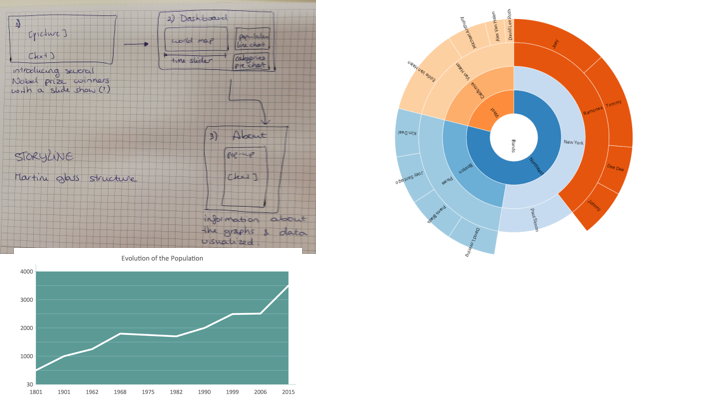

# Proposal

Name: Tula Kaptein  
Student Number: 11013478

## Problem Statement:
### Problem:
It is uncertain how the amount of Nobel prize winners per country over the years correlates to the education quality of that country. Furthermore, there are very few female Nobel prize winners and a possible correlation could be found in the education equity.

### Target audience:
People with an interest in Nobel prize winners and education quality and equity.

## Solution:
### Idea:
To show an interactive world map visualizing the amount of Nobel prize winners per year, which will be linked to several charts showing population, education indicators and education equity indicators.

### Visual sketch:

* Left, upper: a sketch of the sites pages and interactions. I want to start with introducing a few Nobel Prize winners, then make a transition to the 'dashboard'. The dashboard will show the interactive graphs and charts. There will be an option on the page to click on 'about', which will show another page or preferably a pop up with information about the data and graphs.
* Right, upper: a pie chart could be used to show the different fields of the nobel prizes won in a certain year, but a sunburst chart could show the different fields and the nationality and gender at the same time.
* Left, down: an example of a line graph, which would be used to show the educational indicators over the years.

### Main features:
#### 1: Minimum viable product
+ A world map with the amount of nobel prize winners per country
+ The possibility to select a certain year for the world map
+ Show the division over the different fields of the Nobel Prize (chemistry, physics etc.)
+ Show line/bar charts with education indicators and population per country selected.
+ When data points are hovered, show the data value.

#### 2: Optional implementations
+ Possibility of filtering the data in the world map by field of Nobel prize and gender.
+ Show line/bar charts with edcuation equity indicators.

## Prerequisites:
### Data sources:

* [Two datasets: 1) list of all Nobel prizes and 2) list of all Nobel prize winners](https://data.world/sya/nobel-prize-winners/workspace/file?filename=nobel_prize_by_winner.csv )

* [Population per country (1960-2017)](https://data.worldbank.org/indicator/SP.POP.TOTL)

* [Education quality and equity indicators](https://databank.worldbank.org/Data/indicator/SE.PRM.TENR?id=c755d342&report_name=EdStats_Indicators_Report&populartype=series#)

### External components:
* d3
* d3-tip

### Review of similar related visualisations:
[This](https://www.kalinax.com/nobel-prize-winners.html) is a website that visualises Nobel prize winners per country and over time, but the data isn't correlated with anything yet. I would like to use this example to make a world map and the possibility to 'slide through the years', but I'd add another variable: population to be able to say something about the difference in amount of nobel prizes.

### Hardest parts:
* To find a way to correlate the Nobel prize data with other data sets (the timelines of other datasets are usually shorter)
